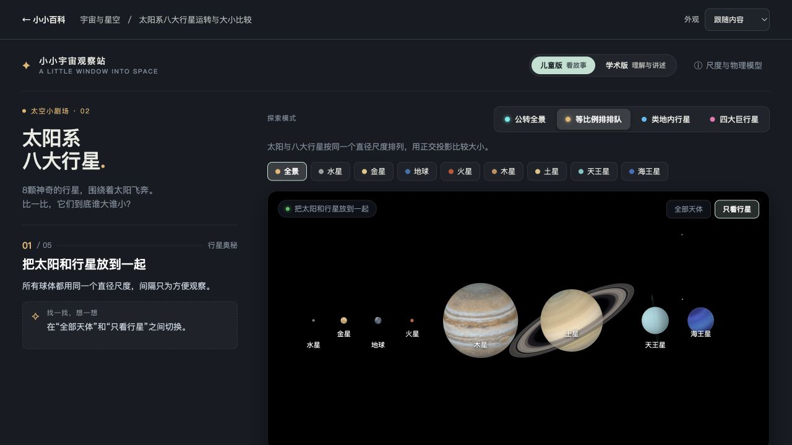

# 小小百科

一个小科普演示集锦，用可以动手探索的页面解释科学现象。每个专题围绕一个小问题展开，配上动画、讲解和参考资料，适合孩子与家长一起观察，也欢迎任何好奇的人。

从宇宙与地球开始，逐步加入自然、生命、物理和工程等主题。



## 现有演示

- [恒星路过黑洞](topics/black-hole/)：换一条路线，观察恒星的不同遭遇。
- [太阳系八大行星](topics/solar-system/)：观察公转，比较行星大小。
- [白天黑夜与四季](topics/earth-seasons/)：探索地球自转与地轴倾角的作用。

## 本地运行

```sh
npm install
npm run dev
```

打开终端提示的本地地址。`npm test` 运行测试，`npm run build` 生成可静态托管的 `dist/`。

新增演示见 [框架与新增专题](docs/architecture.md)。各专题独立维护自己的画面、讲解与资料，通过目录统一浏览。
