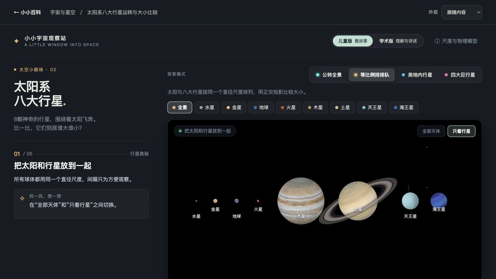

# 小小百科 · Little Encyclopedia

[English](README.en.md)

一个中英双语的小科普演示集锦，用可以动手探索的页面解释科学现象。每个专题围绕一个小问题展开，配上动画、讲解和参考资料，适合孩子与家长一起观察，也欢迎任何好奇的人。

内容涵盖宇宙与星空、地球与自然、生命与身体、物质与现象、科技与工程五类。相互依赖的演示逐步收归到完整专题，原有链接仍可进入相应章节。



## 探索内容

首页支持分类筛选、关键词搜索和分页，每页最多 24 个演示，可直接点击相邻页。完整专题列表见 [内容目录](content/catalog.json)。

| 分类 | 代表专题 |
| --- | --- |
| 宇宙与星空 | [太阳系与行星比较](topics/solar-system/)、[恒星与多星系统](topics/stars/)、[星系与宇宙尺度](topics/cosmic-scale/)、[黑洞](topics/black-holes/) |
| 地球与自然 | [大气](topics/atmosphere/)、[水循环](topics/rain-cycle/)、[风与风暴](topics/wind/)、[火山](topics/volcano-eruption/) |
| 生命与身体 | [一片叶子的一生](topics/leaf-colors/)、[细胞：结构与分工](topics/cells/)、[听觉](topics/hearing/)、[消化](topics/digestion/) |
| 物质与现象 | [彩虹](topics/rainbow/)、[浮力](topics/buoyancy/)、[水的状态](topics/water-states/)、[声音](topics/sound-vibrations/) |
| 科技与工程 | [自来水](topics/tap-water/)、[空调](topics/air-conditioner/)、[冰箱](topics/refrigerator/)、[电池](topics/batteries/) |

本轮生命、地球和宇宙三条理解路径的范围与边界见[专题整合记录](docs/science-journeys-20260920.md)。相关知识通过明确的下一站链接相连，不把所有内容塞进同一页面。

## 阅读与操作

- **儿童版**：用故事、观察问题和互动帮助孩子理解现象，适合亲子共读。
- **学术版**：补充原理、模型假设和资料，供家长及希望深入了解的读者使用。
- 每题都有独立的观察任务、三节学术笔记、常见误解和模型边界；切换讲解方式保留当前实验状态。
- 顶部「解说稿」提供中英双语儿童口播，可分别下载纯口播和分镜稿。全部稿件的导出与配音约定见 [解说稿说明](docs/narration.md)。
- 演示提供各自适用的播放、暂停、进度拖动或条件比较；分子、天体等画面的尺度与简化在专题内说明。
- 支持浅色、深色和跟随内容的外观。目录、导航和控件采用与 glenzli.com 一致的中性色 UI，演示保留各自的科学配色。

页面右上角可切换中文与 English，也支持 `?lang=zh`、`?lang=en` 分享链接。首次访问参考浏览器语言，手动选择会保存在本机；切换语言会重新打开当前专题，动画从头开始。

## 本地开发

新增、融合或优化专题前，先读[设计原则与验收要求](docs/design-principles.md)：包括理解路径、科学因果、连续观察、尺度、视觉、双语、资源生命周期和交付清单。具体工程契约见[开发说明](docs/architecture.md)，源码归属见 [SKELETON.md](SKELETON.md)。

需要 Node.js 22.12 或更新版本。

```sh
npm ci
npm run dev
```

打开终端提示的本地地址。`npm run check` 运行测试、严格类型检查、翻译覆盖检查与生产构建；构建后运行 `npm run preview`，预览可静态托管的 `dist/`。修改源码后需重新构建，预览才会更新。

使用 **TypeScript + Vite + Three.js + i18next**，依赖由 npm 与锁文件管理。每个专题独立打包，首页不加载三维引擎。新增演示与翻译维护见 [开发说明](docs/architecture.md)。
